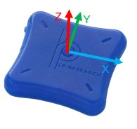

# OpenZen 
> The LP-RESEARCH Motion Sensor (LPMS) is a miniature, multi-purpose inertial measurement unit. [LpmsB2HardwareManual.pdf](https://lp-research.com/wp-content/uploads/2020/03/20200310LpmsB2HardwareManual.pdf)

## GNU/Linux Ubuntu

1. Check OS distribution, kernel and architecture
* OS: Ubuntu 22.04.1 LTS              
```
$ hostnamectl

 Static hostname: --
       Icon name: computer-laptop
         Chassis: laptop
      Machine ID: --
         Boot ID: --
Operating System: Ubuntu 22.04.1 LTS              
          Kernel: Linux 5.15.0-56-generic
    Architecture: x86-64
 Hardware Vendor: --
```

* OS: Ubuntu 20.04.1 LTS
```
$ hostnamectl

   Static hostname: ---
         Icon name: computer-laptop
           Chassis: laptop
        Machine ID: ---
           Boot ID: ---
  Operating System: Ubuntu 20.04.1 LTS
            Kernel: Linux 5.15.0-73-generic
```


* Python package versions
```
$ mamba activate sentient-VE
$ mamba activate sentientbasicVE
$ python package_versions.py 

python: 3.8.16 | packaged by conda-forge | (default, Feb  1 2023, 16:01:55) 
[GCC 11.3.0]
opencv: 4.7.0
torch: 2.0.0.post200
torch cuda_is_available: True
torch cuda version: 11.2
torch cuda.device_count  1
PIL version: 9.5.0
```


2. Install dependencies
```
sudo apt-get update
sudo apt-get install git cmake
sudo apt-get install libbluetooth-dev
sudo apt install build-essential -y #> sudo apt-get install gcc-7
sudo apt-get install python3 
sudo apt-get install python3-dev
 
#Install Qt (5.11.2 or higher) if you need Bluetooth Low Energy support: 
#sudo apt-get install qtbase5-dev qtconnectivity5-dev
``` 

3. Clone openzen 
```
mkdir -p $HOME/repositories && cd $HOME/repositories ## suggested path
git clone --recurse-submodules https://bitbucket.org/lpresearch/openzen.git
cd openzen 
```

3.1 You might like to edit `CMakeLists.txt` but also do `cmake -DZEN_PYTHON=ON ..`
    ```
    vim CMakeLists.txt
    option(ZEN_PYTHON "Compile Python bindings for OpenZen" ON) #LINE72
    ```

4. build and make
```
mamba activate sentientVE #or
mamba activate sentientbasicVE
cd $HOME/repositories/openzen && rm -rf build && mkdir build && cd build
cmake -DZEN_PYTHON=ON ..
make -j4
```

* To test: `-DPython3_EXECUTABLE:PATH=${PYTHON_EXECUTABLE}` [:link:](https://github.com/Slicer/Slicer/issues/5498)


5. Setup bluetooth devices and test connection.
* Setting up LPSENSOR device 
	* Go to bluetooth settings
	* Select device LPMSB2-??? (which will display `Not Set Up`)
	* Confirm Bluetooth PIN (press green confirm button)

* Then you can check dev and scanned devices 
```
hcitool dev
Devices:
	hci0	00:30:91:10:00:26
	hci1	00:1A:7D:DA:71:13
	hci2	A4:9B:4F:B6:00:29

hcitool scan
Scanning ...
	00:04:3E:6F:37:95	LPMSB2-6F3795
	00:04:3E:53:ED:5B	LPMSB2-53ED5B
	00:04:3E:6F:37:7E	LPMSB2-6F377E
```

```
bluetoothctl devices
Device 00:04:3E:53:ED:5B LPMSB2-53ED5B
Device 00:04:3E:6F:37:95 LPMSB2-6F3795
Device 00:04:3E:6F:37:7E LPMSB2-6F377E
```
* pair
```
bluetoothctl pair 00:04:3E:6F:37:95
Attempting to pair with 00:04:3E:6F:37:95
[CHG] Device 00:04:3E:6F:37:95 Connected: yes
[NEW] Primary Service (Handle 0xd461)
	/org/bluez/hci0/dev_00_04_3E_6F_37_95/service0018
	26cc3fc0-6241-f5b4-5347-63a3097f6764
	Vendor specific
[NEW] Characteristic (Handle 0xd461)
	/org/bluez/hci0/dev_00_04_3E_6F_37_95/service0018/char0019
	bf8796f1-64f7-70b5-1e41-09bb46d79100
	Vendor specific
[NEW] Characteristic (Handle 0xd461)
	/org/bluez/hci0/dev_00_04_3E_6F_37_95/service0018/char001b
	bf8796f1-64f7-70b5-1e41-09bb46d79101
	Vendor specific
[NEW] Characteristic (Handle 0xd461)
	/org/bluez/hci0/dev_00_04_3E_6F_37_95/service0018/char001d
	bf8796f1-64f7-70b5-1e41-09bb46d79102
	Vendor specific
[NEW] Characteristic (Handle 0xd461)
	/org/bluez/hci0/dev_00_04_3E_6F_37_95/service0018/char001f
	bf8796f1-64f7-70b5-1e41-09bb46d79103
	Vendor specific
[CHG] Device 00:04:3E:6F:37:95 UUIDs: 00001101-0000-1000-8000-00805f9b34fb
[CHG] Device 00:04:3E:6F:37:95 UUIDs: 00001800-0000-1000-8000-00805f9b34fb
[CHG] Device 00:04:3E:6F:37:95 UUIDs: 0000180f-0000-1000-8000-00805f9b34fb
[CHG] Device 00:04:3E:6F:37:95 UUIDs: 26cc3fc0-6241-f5b4-5347-63a3097f6764
[CHG] Device 00:04:3E:6F:37:95 ServicesResolved: yes
```

6. Now you can run the OpenZenExample:
```
cd $HOME/repositories/openzen/examples
./OpenZenExample
```

```
./OpenZenExample
Listing sensors:
[2022-07-16 11:02:49.362] [OpenZen_console] [info] Starting listing of Bluetooth devices
0: LPMSB2-6F377E (Bluetooth)
Provide an index within the range 0-0:
Note that the default connection baud rate is 921600, which is not the case for LPMS-BE/ME sensors. 
More details in the comment of this program.
```


## Python scripts 
7. Run python `hello-sensor.py`
Open a new terminal (or tab)
``` 
cd $HOME/repositories/sentient/dependencies/openzen
export PYTHONPATH=$HOME/repositories/openzen/build
python hello-sensor.py
```
NB. You might need to keep your sensor disconnected from the bluetooth settings.

8. `hello-multi-sensor.py`
Open a new terminal (or tab)
``` 
cd $HOME/repositories/sentient/dependencies/openzen
export PYTHONPATH=$HOME/repositories/openzen/build
python hello-multi-sensors.py
```
Notes by Yab from LP-RESEARCH:
* Internally openzen has a data queue that stores streamed data from the sensor. 
  It is recommended to clear the sensor queue before starting sensor data streaming. 
  Otherwise, when calling the `wait_for_next_event()` function, openzen will returned the earliest data in the queue.
* The synchronization between sensor is done via "software". 
  So even after synchronization, there will be some delay between the timestamps of two sensors. 
  When the sensor is streaming data to the PC, the order of the data is not guaranteed to alternative between sensor 1 and 2.
* Please note that the problem mentioned above will be more obvious when sensors are streaming a lot of data at high frequency. 
  You will notice less of a problem when you reduce the streaming frequency of the sensors

## Coordinates 
The LPMS sensor calculates the orientation difference between a fixed sensor 
coordinate system (S) and a global reference coordinate system (G). Both coordinate
systems are defined as right-handed Cartesian coordinate systems. The sensor
coordinate system (S) is constructed as following images.
While the orientation calculation is using all acceleration, gyroscope and
magnetic data (sensor filter mode set at acc+gyr+mag), (G) system is defined as
following:
• X positive when pointing to the magnetic north
• Y positive when pointing to the magnetic west
• Z positive when pointing up (gravity points vertically down with -1g)
See further details: [LpmsB2HardwareManual.pdf](https://lp-research.com/wp-content/uploads/2020/03/20200310LpmsB2HardwareManual.pdf).
 



## Windows OS (not fully tested)

### Requirements
Pre-compiled bynaries for Windows x64-bit (supporting CSharp, Python and Bluetooth):
* openzen.pyd
* SiUSBXp.dll #not needed if Bluetooth connection

Make sure the `openzen.pyd` and `SiUSBXp.dll` are in the same folder as this hello-sensor.py file.
You might need to download compressed files from latest version in https://bitbucket.org/lpresearch/openzen/downloads/?tab=downloads 

### Streaming motion data
To run scripts activate your conda environment and run hello-sensor.py and press Ctrl+C to stop the program.
``` 
cd $HOME/repositories/sentient/dependencies/openzen
mamba activate sentient
python hello-sensor.py
```

## Troubleshooting
### how-to-manually-stop-a-python-script-that-runs-continuously-on-linux
```
ps -ef | grep "python" | awk '{print $2}'
ps -ef | grep "python" | awk '{print $2}' | xargs sudo kill 
```
## References
* https://www.lp-research.com/9-axis-bluetooth-imu-lpmsb2-series/
* https://bitbucket.org/lpresearch/openzen/src/master/   
* https://github.com/xfetus/pe/tree/main/hardware/sensors/imus-LPMS-B2/adquistion-software/ros/openzen  
* https://lpresearch.bitbucket.io/openzen/latest/setup.html
* https://lp-research.atlassian.net/wiki/spaces/LKB/pages/1100611599/LPMS+User+Manual
* For windows: https://lpresearch.bitbucket.io/openzen/latest/setup.html 
* https://www.baeldung.com/linux/bluetooth-via-terminal


