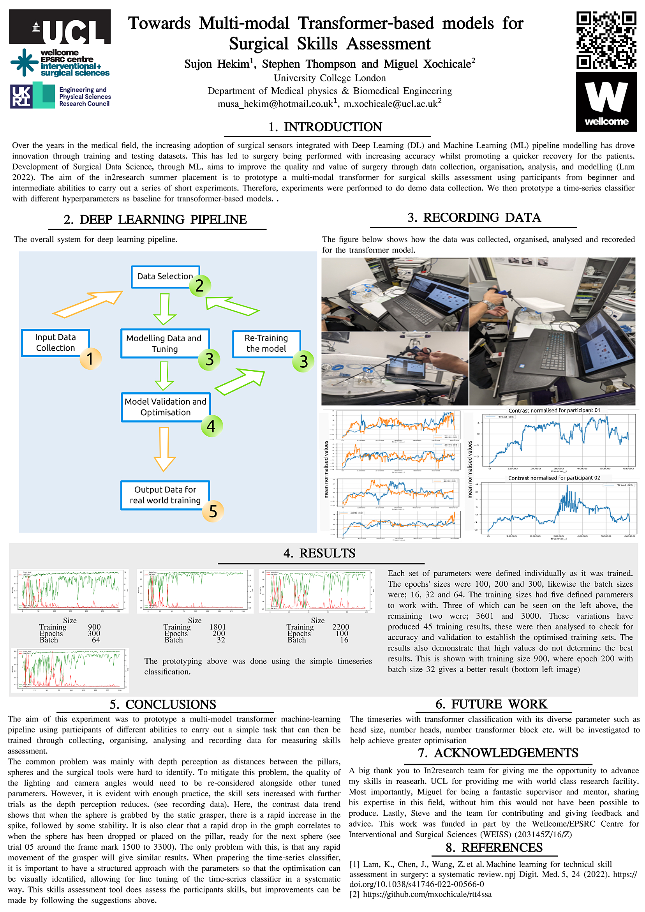

# The In2research Celebration Event 
Friday 8th September, at the Royal Institution, London

The In2research Celebration Event will take place on the afternoon of Friday 8th September, at the Royal Institution, London. We would be delighted to have you there to celebrate the successes of this year’s programme! 

The participants will be presenting the research that they have participated in during their 8 week placement - this will be in the form of a poster or powerpoint presentation (which will be printed), or another output (such as an essay or video) which will be accessible to attendees through a QR code. The participants will have the opportunity to discuss their research with attendees who will be walking around, viewing all the outputs. There will be no formal talks or presentations being given by participants. 

1. The participant will be the one who presents the research - there will be a timeslot where the participant will stand next to their research output and discuss their research with attendees who will be walking around the room. They will also have a timeslot where they can walk around the room and discuss other participants' research. 
2. For STEM participants, we suggest creating a poster, as this is one of the most common forms of research communication in those subjects. For Arts and Humanities or Social Sciences participants, we would expect the participant and host to discuss the most effective format they can use to communicate their research within their subject. 
3. The attendees will include this year's fellow participants, hosts and mentors and the programme's partners and funders. 

PS. we will just have the participants' output (e.g. poster) displayed throughout the venue and attendees will be able to circulate these, talking to participants who will be next to their outputs, just as they would at a poster conference. 

## Poster design and edition 
To desing and edit your poster, you need to use https://inkscape.org/release/ which open-source and works in multiple Operative Systems. 

### Edition
* For cropping images: create a rectangue and overlay with your image, you can then make use of "Object>Clip>Set" to crop images.
* For scaling images: Make use of the lock icon "When locked change both width and height by the same proportion"

### Rendering  PDF in inkscape
1. Open poster: 
	inkscape *.svg

2. GO TO PRINT
3. Select print-to-file
4. Select path and filename in `GENERAL` tab, usually `~/Documents/output.pdf` (then you can rename it) 
5. RENDERING>BITMAP (300dpi default)
6. PRINT

### converting pdf to image
```
convert -verbose -density 50 -trim *.pdf -quality 100 -flatten -sharpen 0x1.0 *.jpg
```
You might get `imagemagick - convert not allowed` to which you need to add this line in `/etc/ImageMagick-6/policy.xml`

`<policy domain="coder" rights="read|write" pattern="PDF" />` 
https://askubuntu.com/questions/1127260/imagemagick-convert-not-allowed 

## Poster


## References 

* Miguel Xochicale's poster: 
PNG: https://github.com/budai4medtech/miua2022/blob/main/poster/resources/versions/drawing-v08.png   
SVG: https://github.com/budai4medtech/miua2022/blob/main/poster/resources/vectors/drawing-v08.svg  

* Some references that might help to design a posters   
https://www.behance.net/gallery/30160927/Scientific-Posters  
https://mindthegraph.com/blog/award-winning-scientific-poster/  
https://www.animateyour.science/post/best-examples-of-scientific-posters  
https://peerj.com/blog/post/115284883237/peerj-award-winner-beata-mierzwa-best-scientific-poster-award-at-vizbi-2019/  
and many more https://www.google.co.uk/search?q=Award-winning+scientific+poster+examples&tbm=isch&ved=2ahUKEwjMlovN2vKAAxUUpicCHVWEApwQ2-cCegQIABAA&oq=Award-winning+scientific+poster+examples&gs_lcp=CgNpbWcQAzIHCAAQigUQQ1AAWABgggdoAHAAeACAAUyIAUySAQExmAEAqgELZ3dzLXdpei1pbWfAAQE&sclient=img&ei=l_HlZIzvEZTMnsEP1YiK4Ak&bih=1104&biw=1920   


