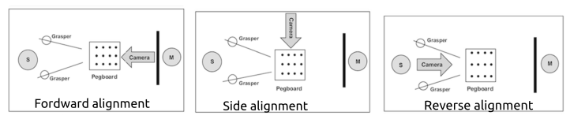

# Experiment protocol for demo-data collection 24-Aug-2023

## Setting up computer
1.1 Defining the parameters for the data collection   
1.2 Calibrate the data where necessary to add value   

## Setting training box
2.1 Training box needs to be placed in a suitable surface  
2.2 It needs to be well out of sight   

## Setting up sensors
3.1 Pairing the sensor with computer  
3.2 Testing the sensor to see if it corresponds with the computer by collecting data  
3.3 Attaching the sensor on to the static grasper (check orientation)  
3.4 Positioning the camera in a suitable place and fixing it on to the training box  
3.5 Checking and confirming the display screen    

## Pre demo-data collection  
4.1 Collect data with 2 light conditions    
    Five repetitions of 60 seconds with light condition 1   
    Five repetitions of 60 seconds with light condition 2 

4.2 Collect data with static grasper  
    Five repetitions of 60 seconds with different poses of grasper 

4.3 Collect data with different sphere colours

## Demo-data collection with Peg Transfer Exercise
Practice task: 10 beads are transferred from the floor using left grasper to lift with a mid-air transfer to the contralateral grasper that put beads in the top of the pillar.
Experiment task: 10 beads are transferred using one grasper and put them in the top of the pillars.

5.1 Practice round 01 - 2 grasper. 10 beads for pegs transfer for 300 seconds (5 minutes) with (forward alignment)  
5.1 Practice round 02 - 1 grasper. 10 beads for putting beads into the pillars. 300 seconds (5 minutes) with (forward alignment)  
5.4 Test-01 - 2 repetitions (reverse alignment) (10 minutes)   
5.3 Test-02 - 2 repetitions (side alignment) (10 minutes)   
5.2 Test-03 - 2 repetitions (forward alignment) (15 minutes)   

      
Figure. Experiment configurations from Miura et al. 2019. 

## References
> Lam, Kyle, Junhong Chen, Zeyu Wang, Fahad M. Iqbal, Ara Darzi, Benny Lo, Sanjay Purkayastha, and James M. Kinross. 
> "Machine learning for technical skill assessment in surgery: a systematic review." 
> NPJ digital medicine 5, no. 1 (2022): 24.  
> https://www.nature.com/articles/s41746-022-00566-0  
> Google-scholar: https://scholar.google.com/scholar?cites=18255856507017471578 

> Heiliger, Christian, Dorian Andrade, Christian Geister, Alexander Winkler, Khaled Ahmed, Alessandra Deodati, 
> Viktor H. Ehrlich V. Treuenstätt et al. 
> "Tracking and evaluating motion skills in laparoscopy with inertial sensors." 
> Surgical Endoscopy (2023): 1-11. 
> https://link.springer.com/article/10.1007/s00464-023-09983-y 

> Miura, Susumu, Taro Oshikiri, Yukiko Miura, Gosuke Takiguchi, Nobuhisa Takase, Hiroshi Hasegawa, Masashi Yamamoto et al. 
> "Optimal monitor positioning and camera rotation angle for mirror image: overcoming reverse alignment during laparoscopic colorectal surgery." 
> Scientific Reports 9, no. 1 (2019): 8371.
> Google-citations https://scholar.google.com/scholar?cites=7165608588281984941&as_sdt=2005&sciodt=0,5&hl=en

